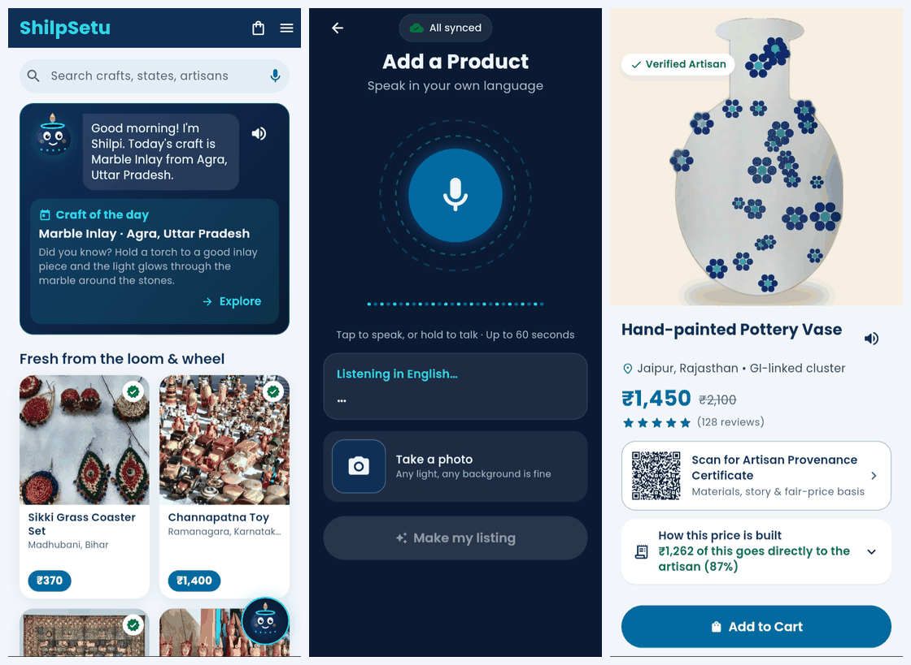
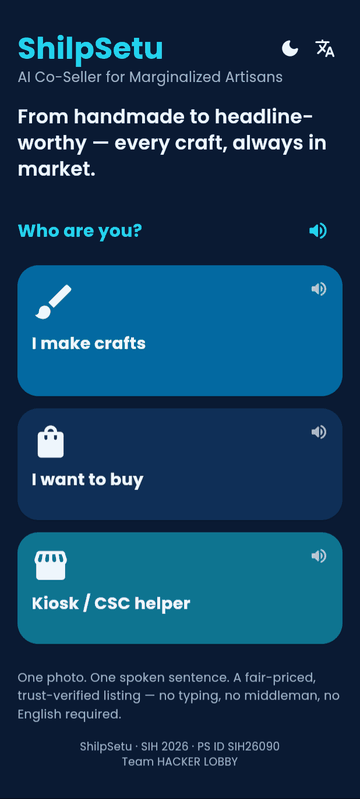
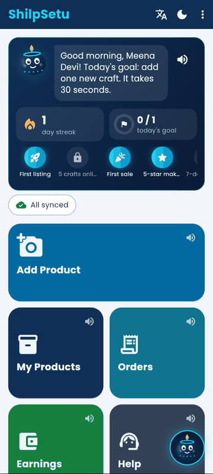
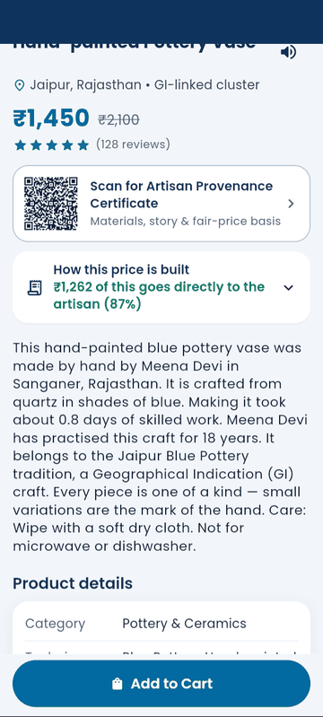
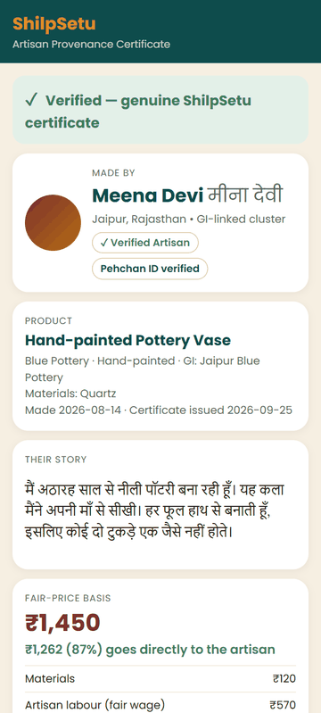
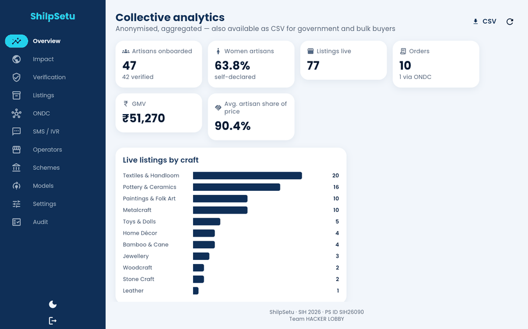

# ShilpSetu — AI Co-Seller for Marginalized Artisans

> **From handmade to headline-worthy — every craft, always in market.**
>
> One photo. One spoken sentence. A fair-priced, trust-verified listing — no typing, no middleman, no English required.

A voice-first, offline-capable mobile app that turns **one photo and one spoken sentence** into a
**fair-priced, trust-verified, marketplace-ready listing** — published to its own storefront **and** the
ONDC network — for the artisans that periodic exhibitions leave behind.

**Smart India Hackathon 2026 · Problem Statement SIH26090 · Ministry of Social Justice & Empowerment (MoSJE) ·
Theme: Heritage & Culture · Category: Software · Team HACKER LOBBY**


<sub>Storefront home · "Add a Product" voice + photo capture · product detail with fair price and QR certificate — screenshots of the running app.</sub>

---

## The problem

1. **Market access only a few days a year.** Government exhibitions remain the main sales channel for artisans.
   Between fairs there is almost no way to reach buyers.
2. **Middlemen absorb most of the margin.** 66 % of handloom weavers earn under ₹5,000 a month, while the crafts
   they make sell for many times that (All-India Handloom Census 2019-20). Pricing is opaque; artisans rarely
   see how much of the final price actually reaches them.
3. **Mainstream e-commerce stays out of reach.** Low digital literacy and language barriers keep artisans off the
   platforms that already sell everything else.

### The opportunity already exists

| | |
|---|---|
| **65 %** | growth in handicraft exports over the last decade (2014-15 → 2024-25) |
| **₹33,123 Cr** | handicraft export value in FY 2024-25 |
| **64 %** | of artisans are women — 71 % among handloom weavers |
| **ONDC / DigiHaat** | the government is actively onboarding artisans and farmers onto open digital commerce |

None of this is a bet on the future — the market pull, the policy support and the export momentum already exist.
What's missing is a way for individual artisans to actually reach it.

## Before → after

| Before | After |
|---|---|
| No photos, no listing, no online presence | **One photo, AI-enhanced and ready to publish** |
| Price guessed — or dictated by middlemen | **Transparent AI fair-price shown to every buyer** |
| Buyers can't verify who actually made it | **QR certificate proves the artisan and the story** |

## From craft to cart in 5 steps

| | Step | What happens |
|---|---|---|
| 🎙 | **Speak** | The artisan describes the product in their own language. |
| 📷 | **Snap** | One photo — any lighting, any background. (Steps 1 and 2 in either order, fully offline.) |
| ✨ | **AI builds it** | Transcription, title/description/category, translations, cleaned-up photo, fair price, certificate draft — each step shown and spoken; missing facts asked by voice. |
| ✅ | **You approve** | One review card, read aloud; one tap. Change price by voice, retake, re-record. |
| 🌐 | **Goes live** | On the ShilpSetu storefront **and** the ONDC network, with a signed QR certificate. |

The loop doesn't stop at step 5 — buyer views and orders quietly retrain the price-recommendation and ranking
models over time.

## What makes it different

| Capability | No digital presence | Typical listing app | **ShilpSetu** | Proven by |
|---|---|---|---|---|
| Works without typing — voice-first entry | ✗ | partial | ✓ | `test_works_without_typing_voice_first` |
| Shows **how the price is built**, not just matched | ✗ | ✗ | ✓ | `test_shows_how_the_price_is_built` |
| Proves authenticity with a **per-item certificate** | ✗ | ✗ | ✓ | `test_per_item_certificate` |
| Works **offline / on low connectivity** | n/a | ✗ | ✓ | `test_works_offline_low_connectivity`, `sync_queue_test.dart` |
| Understands **regional / vernacular languages** | n/a | partial | ✓ | `test_understands_vernacular_languages` |
| Publishes **straight to the ONDC network** | ✗ | partial | ✓ | `test_publishes_straight_to_ondc` |

(`services/tests/test_differentiators.py` — one automated test per row.)

### Also in the app

- **Shilpi, the assistant.** A Duolingo-style mascot that talks and listens in the user's language.
  - *Artisans:* daily listing streak, a daily goal, badges, tips, and a celebration when a product goes live.
  - *Buyers:* a craft of the day, gift ideas for any budget, and the story of any art form.
  - *How it answers:* a rule-based engine works offline; `ASSISTANT_PROVIDER=claude` rewrites answers with Claude, grounded in the same facts (`services/tests/test_assistant.py`).
- **Every Indian art form.** 47 artisans and 80 products across 35+ crafts, from Madhubani and Pashmina to Bidri, Longpi and Tholu Bommalata. Each product page shows the art form's history, how it is made, a "did you know", its GI tag and product details. Real craft photos come from Wikimedia Commons, with credits on the About screen.
- **Affordable, still fair.** The platform fee is 4 %, buyers keep 75 % of the gap to market price, and small parcels cost less to ship. Gifts start around ₹200, and the artisan's hourly wage floor is never cut.
- **Navy + cyan theme** with a light/dark switch that follows the phone on first launch, and a cinematic *SHILPSETU* opening title.

## Screenshots

| Welcome (Hindi) | Artisan home (audio-first) | How this price is built | Public certificate check |
|---|---|---|---|
|  |  |  |  |



## Architecture

```
ACCESS            →  CAPTURE              →  AI PROCESSING                 →  TRUST & PRICING                →  DISTRIBUTION
Android app or       One photo +             Image enhancement •              Fair-value price +                 App storefront +
assisted kiosk       one spoken sentence     ASR/NLU • price model            provenance certificate             ONDC network
```

Offline captures queue on-device and sync automatically once connectivity returns.
Details: [docs/architecture.md](docs/architecture.md) · API: [docs/api.md](docs/api.md) (102 operations,
generated from OpenAPI) · Demo: [docs/demo_script.md](docs/demo_script.md).

| Proposal item | Built with |
|---|---|
| Flutter (cross-platform) | Flutter 3.47 / Dart 3.13 — Android app + web storefront (`apps/mobile`), web admin (`apps/admin_web`), shared design system (`apps/shared`) |
| Offline-first local cache | Drift (SQLite; WASM + IndexedDB on web), persistent upload queue, media files kept until synced |
| FastAPI | Python 3.11+ FastAPI (`services/api`), versioned `/api/v1`, OpenAPI |
| PostgreSQL | PostgreSQL 16, SQLAlchemy 2, Alembic (26 tables) |
| Indic ASR & NLU | Bhashini ULCA + AI4Bharat adapters, IndicTrans2 / Bhashini NMT, Claude for listing generation — all behind interfaces with mocks |
| Computer-vision cleanup | rembg U²-Net background removal (GrabCut fallback), gray-world white balance, CLAHE + gamma exposure, denoise, auto-crop, cream composite with soft shadow, 1:1 + 4:5 JPEG + WebP thumb |
| Price-recommendation model | transparent cost-plus + `HistGradientBoostingRegressor` quantile market model (p20/p50/p80), versioned, retrained from sales |
| ONDC seller APIs | Beckn BPP (`search/select/init/confirm/status/cancel`), catalog sync, Ed25519 + BLAKE2b request signing, mock gateway + fake buyer app |
| Cloud object storage | S3 API — MinIO in docker-compose, local disk without Docker |
| SMS / IVR helpdesk | Twilio / Exotel adapters + mock; regional-language templates; IVR menu (orders / earnings / callback), accept orders by key press or SMS reply |

## Quick start

### With Docker (full stack)

```bash
cp infra/.env.example infra/.env        # optional — defaults are all mocks
cd infra && docker compose up --build   # postgres, redis, minio, api, ai, workers, ondc_adapter, admin_web
# API + Swagger:            http://localhost:8000/docs
# Mock ONDC buyer app:      http://localhost:8000/ondc-mock/buyer
# Public certificate page:  http://localhost:8000/v/<certificate-id>
cd ../apps/mobile && flutter run --dart-define=API_BASE=http://10.0.2.2:8000   # Android emulator
```

On first start the API runs `alembic upgrade head` and seeds the demo (47 artisans across India's art forms, 80 products).
The `admin_web` service serves Flutter web builds from `apps/*/build/web` — run
`flutter build web --no-tree-shake-icons` in `apps/admin_web` and `apps/mobile` first (admin on :8080,
buyer storefront on :8081).

### Without Docker (what the test-suite uses)

```bash
python -m venv .venv && .venv/Scripts/activate        # source .venv/bin/activate on Linux/macOS
pip install -r services/requirements.txt
cd services
python -m scripts.seed --reset                         # SQLite in services/.data, local media, mock providers
uvicorn api.main:app --port 8000
# second terminal
cd apps/mobile && flutter pub get && flutter run -d chrome     # or an Android device/emulator
cd apps/admin_web && flutter pub get && flutter run -d chrome
```

Demo logins (the OTP is shown on screen in mock-SMS mode): admin `+919000000000`, buyer `+919000000001`,
artisan Meena Devi `+919000000002` (Hindi), kiosk operator `+919000000009`.

### Tests

```bash
cd services && pytest                         # 63 tests: price engine, certificates, NLU fixtures, sync, 5-step flow, differentiators, security
cd apps/mobile && flutter test                # sync queue (7) + the three mockup screens + translations
cd apps/admin_web && flutter test
cd apps/shared && flutter test
```

## Public demo server (any network)

The phone app needs an API it can reach from mobile data. `render.yaml` deploys one free Render web service
from `infra/render.Dockerfile`:

1. Push this repository to GitHub (a private repository is fine).
2. On [render.com](https://render.com), sign in with GitHub. Choose **New → Blueprint**, select the repository, then **Apply**.
   The first build seeds the demo data into the image and takes about 10–15 minutes.
3. Open the service URL. The same server hosts everything:
   - `https://<service>.onrender.com/`: the web app (storefront, artisan and kiosk)
   - `/admin/`: the admin dashboard
   - `/docs`: the API reference

   The web builds are committed in `services/webapp`. After changing either app, rebuild them with `sh infra/build_web.sh`.
4. Build the APK against the service URL:
   `flutter build apk --release --no-tree-shake-icons --split-per-abi --target-platform android-arm64 --dart-define=API_BASE=https://<service>.onrender.com`

On the free plan:
- **Sleep:** the server sleeps after about 15 idle minutes. The next request takes about a minute to wake it; the app waits up to 90 s.
- **Resets:** each wake-up restores the clean seeded demo, so orders and uploads made during a session do not persist.
  Use Postgres and S3 (`DATABASE_URL`, `STORAGE_PROVIDER=s3`) on a paid instance for real use.
- **Logins:** login codes for buyers, artisans and kiosk operators appear on screen. The admin code is written only to the
  service log (`SHOW_ADMIN_OTP=false`).

## Configuration

All settings are environment variables (see [`infra/.env.example`](infra/.env.example)); provider switches can
also be changed at runtime in **Admin → Settings**.

| Variable | Default | Purpose |
|---|---|---|
| `DATABASE_URL` | SQLite in `services/.data` | `postgresql+psycopg://…` in Docker |
| `JWT_SECRET`, `PII_ENCRYPTION_KEY`, `CERT_SIGNING_KEY_PATH` | dev values generated | **set real values in production** (the app refuses to start in `ENV=prod` without the PII key and certificate key) |
| `ASR_PROVIDER` | `mock` | `bhashini` / `ai4bharat` |
| `NLU_PROVIDER` | `mock` | `claude` |
| `ASSISTANT_PROVIDER` | `mock` | `claude` (needs `ANTHROPIC_API_KEY`) |
| `TRANSLATION_PROVIDER` | `mock` | `bhashini` / `indictrans2` |
| `STORAGE_PROVIDER` | `local` | `s3` (MinIO/AWS) |
| `SMS_PROVIDER`, `IVR_PROVIDER` | `mock` | `twilio` / `exotel` |
| `PAYMENT_PROVIDER` | `mock` | `razorpay` |
| `ONDC_MODE` | `mock` | `sandbox` / `production` |
| `JOB_MODE` | `inline` | `rq` (Redis workers), `sync` (tests) |
| `BACKGROUND_REMOVAL`, `REMBG_MODEL` | `auto`, `u2net` | `grabcut` / `off`; `u2netp` for small servers |
| `DEFAULT_COMMISSION_PCT`, `DEFAULT_FAIR_WAGE_PER_HOUR` | 6, 100 | editable in Admin → Settings (plus per-state wage floors) |
| `TEAM_ID` | `[Your Team ID]` | shown on About screens (app: `--dart-define=TEAM_ID=…`) |

### Switching from mocks to real providers

| Provider | Steps |
|---|---|
| **Bhashini** (ASR + translation) | Register at bhashini.gov.in/ulca → set `BHASHINI_USER_ID`, `BHASHINI_API_KEY` (and pipeline id) → `ASR_PROVIDER=bhashini`, `TRANSLATION_PROVIDER=bhashini`. |
| **AI4Bharat / IndicTrans2** | Serve IndicConformer/IndicWhisper and IndicTrans2 behind HTTP (`{"language","audio_b64"}` → `{"text"}`; `{"text","src_lang","tgt_lang"}` → `{"translation"}`) → set `AI4BHARAT_ASR_URL`, `INDICTRANS2_URL`. |
| **LLM listing generation** | `ANTHROPIC_API_KEY`, `NLU_PROVIDER=claude` (model `claude-opus-5`, structured JSON output, server-side refusal fallbacks enabled). Falls back to the rule-based extractor on any error. |
| **SMS / IVR** | Twilio: `TWILIO_ACCOUNT_SID/AUTH_TOKEN/FROM_NUMBER`; Exotel: `EXOTEL_SID/API_KEY/API_TOKEN/CALLER_ID`. Point the provider's voice webhook to `/api/v1/notify/ivr/incoming` and SMS webhook to `/api/v1/notify/sms/incoming`. |
| **Payments** | Razorpay test keys → `PAYMENT_PROVIDER=razorpay`; webhook `/api/v1/payments/webhook` with `RAZORPAY_WEBHOOK_SECRET`. |
| **ONDC** | Register as a Seller NP in the ONDC registry with the signing key from `GET :8001/ondc/subscriber`; set `ONDC_SUBSCRIBER_ID/URI`, `ONDC_SIGNING_PRIVATE_KEY`, `ONDC_GATEWAY_URL`, `ONDC_MODE=sandbox`. |
| **Object storage** | `STORAGE_PROVIDER=s3` + `S3_*` (MinIO is already wired in docker-compose). |

## Repository layout

```
apps/mobile         Flutter app — artisan, buyer and kiosk modes (Android + web)
apps/admin_web      Flutter web — admin / MoSJE / CSC dashboard
apps/shared         design system (colours, Poppins/Lora/Noto fonts), API client, shared widgets
services/api        FastAPI: auth, artisans, operators, capture, products, pricing, certificates, storefront, orders, admin
services/ai         ASR/translation providers, NLU & listing generation, image enhancement, price model, ranking
services/ondc_adapter  Beckn BPP adapter, request signing, catalog mapping, mock gateway + buyer app
services/notify     SMS / IVR providers, regional-language templates, IVR menu
services/workers    job queue (inline/RQ), AI build, ONDC sync, nightly retraining scheduler
infra/              docker-compose, nginx, .env.example
docs/               architecture, API reference, demo script, screenshots
seed/               demo data, product photos, demo audio clip + transcript
```

## Sustainable model

Small, transparent commission on each order (default 4 %, shown to buyer and artisan); anonymised collective
analytics for government and bulk buyers (Admin → Overview → CSV); logistics tie-ups through the logistics
adapter. It builds on what exists — CSCs, SHGs and the Pehchan Artisan ID — and fits MoSJE's mandate and the
NHDP, CHCDS and SFURTI schemes (scheme tagging in Admin → Schemes).

## Roadmap

| Phase | Timeline | Scope |
|---|---|---|
| Pilot | 0–3 months | 2–3 artisan clusters; core voice + photo + pricing flow live |
| Cluster expansion | 3–9 months | Onboard SHGs & CSCs across a state; ONDC sync |
| Scale & trust | 9–18 months | Provenance certification, multi-language rollout, logistics tie-ups |
| Sustained growth | 18+ months | Nationwide artisan network with a self-funding commission model |

## The ask

A chance to pilot ShilpSetu with real artisan clusters — turning the periodic exhibition into a permanent, fair,
always-on digital storefront.

## Sources

PIB (Dec 2025) · All-India Handloom Census 2019-20 · India Development Review · Export Promotion Council for
Handicrafts (EPCH) · ONDC DigiHaat · SIH26090 problem statement · Ministry of Social Justice & Empowerment.

---

ShilpSetu · SIH 2026 · PS ID SIH26090 · Team HACKER LOBBY
